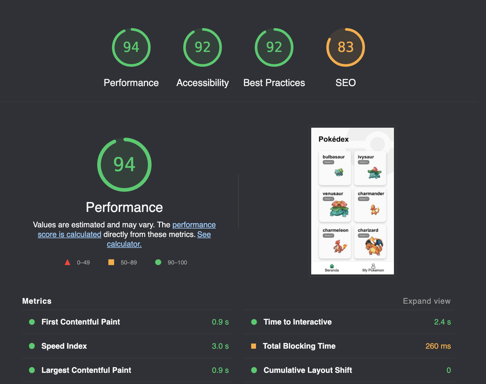

This is a [Next.js](https://nextjs.org/) project that show list and store pokemon from Graphql pokeAPI ( [https://graphql-pokeapi.vercel.app/]() )

## Getting Started

First, run the development server:

```bash
npm run dev
# or
yarn dev
```

Open [http://localhost:3000](http://localhost:3000) with your browser to see the result.

## Performance

Test Production ( https://pokemon-lyart-theta.vercel.app ) on Lighthouse :



## Project Structure

```
.
├── README.md                # README file
├── next.config.js           # Next JS configuration
├── public                   # Public folder
├── src
│   ├── components           # Components
│   ├── lib                  # Graphql with apollo client
│   ├── pages                # NextJS pages
│   ├── styles               # Global style
└── tsconfig.json            # TypeScript configuration
```
